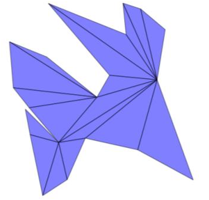
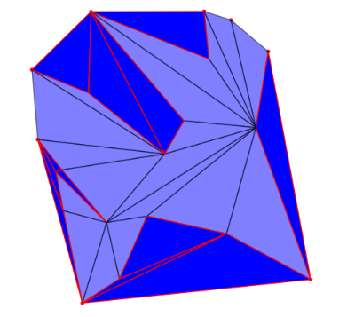
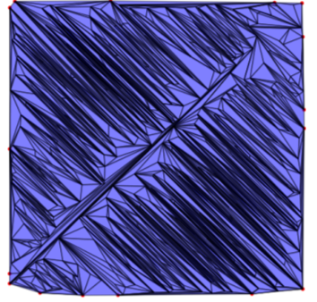
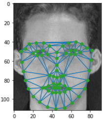

# Final Project 6: Computational Geometry

## Introduction

A Delaunay triangulation is a connected and convex network of triangles that satisfies the Delaunay condition. This condition states that the circumscribed circle of each triangle in the network should not contain any vertex of another triangle. Delaunay triangulations are highly relevant in computational geometry, especially in computer 3D graphics.

It is named after the Russian mathematician Borís Nikolaevich Delone, who conceived it in 1934; Delone used the French form of his surname, "Delaunay", as a tribute to his French predecessors.

There are several possible strategies for calculating the Delaunay triangulation from a given set of input points. We have focused on the edge-flip algorithm and the incremental random algorithm, also known as the Bowyer-Watson algorithm.

## Delaunay Triangulation by Flips

Delaunay triangulation by "flips" of a point cloud starts with a previous triangulation of the cloud and iteratively corrects the illegal edges. The first step is to obtain a preliminary triangulation of the point cloud.

### Preliminary Triangulation

The preliminary triangulation is essentially done using the ear-clipping method. It is important to note that this algorithm performs triangulation on a polygon, not on a point cloud. We propose a method that obtains a complete triangulation of the point cloud from a preliminary triangulation of an arbitrary polygon whose vertices are the points of the cloud.

If the polygon obtained from the point cloud is convex, no further modifications are needed, as the triangulation of the polygon matches the triangulation of the cloud. Otherwise, there will be pairs (or more) of consecutive vertices on the convex hull, denoted as \(C_i, C_{i+1}\).

*Initial triangulation of the arbitrary polygon.*

### Delaunay Triangulation

Once we have the preliminary triangulation, we can perform the Delaunay triangulation. The intuitive idea behind the algorithm is to legalize the edges until no illegal ones remain.

*Result of the Delaunay triangulation.*

## Delaunay Triangulation by the Incremental Algorithm

Calculating the Delaunay triangulation is computationally expensive. To address this problem, several improvements to existing algorithms have been developed. These algorithms are incremental, meaning they build the final triangulation on top of previously existing Delaunay triangulations by adding new points to the set.

### Bowyer-Watson Algorithm

The operation of this algorithm is quite simple. First, we enclose the entire point cloud in a triangle, which we will call the super-triangle. Then, we add points from the cloud one by one to the triangulation.

## Application

In this section, we aim to triangulate the characteristic points of different people's faces to perform facial recognition. This replicates the experiment conducted in the research paper: [Facial Recognition with PCA and Delaunay Triangulation](https://arxiv.org/abs/2011.12786).

The idea is to improve the accuracy of the detection model based on PCA by adding a comparison of the facial morphology using Delaunay triangulation.

## Instructions

1. Choose the number of points you want your point cloud to have.
2. Select one of the two algorithms to perform the Delaunay triangulation: Incremental or Edge-flips.
3. Visualize the process or the final result of the triangulation.

---

*Last modified: January 12, 2025.*
